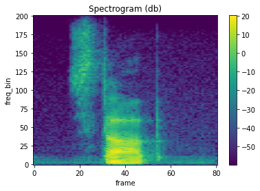
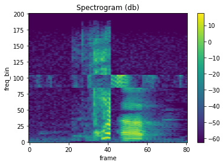

# PyTorch Implementation of SpecMix : A Mixed Sample Data Augmentation method for Training with Time-Frequency Domain Features

[Link to the paper](https://arxiv.org/abs/2108.03020) \\

Before: 

After: 

**Note: Visual comparisons may not be apparent due to different scales. I have tried to manually test my code. Raise an issue if you find a bug/logical error.**
